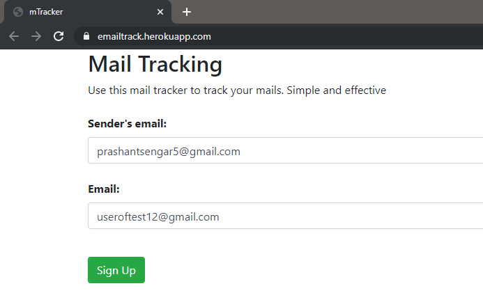
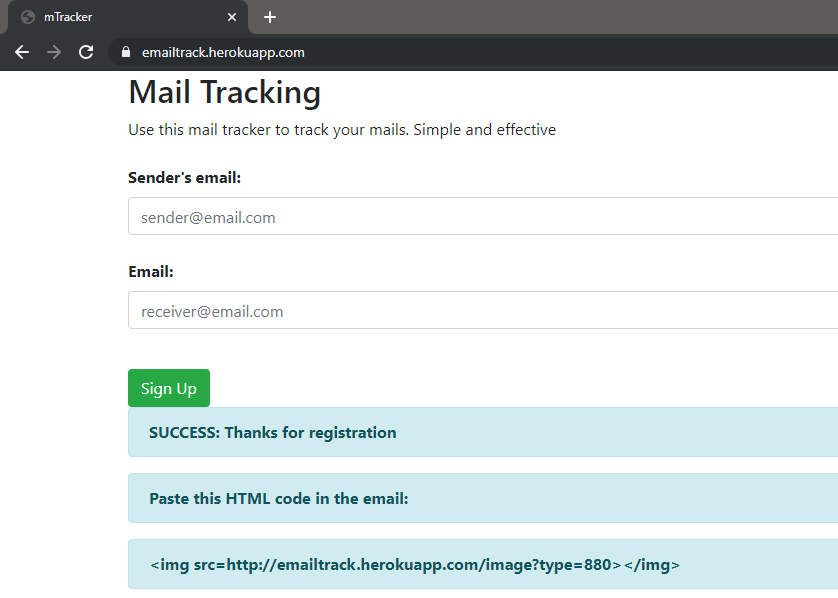

# mTracker

This is a very basic mail tracking service which I developed for my personal use.

To see it working, visit [mTracker](https://https://emailtrack.herokuapp.com/)

You can read about the project in my [blog](https://prashants.in/blog/python-flask-e-mail-tracker/)

## How to use it:

1. Visit the website

2. Fill the form

3. Get the HTML code

4. Add the HTML code to your mail body HTML. [This video](https://youtu.be/MsMSqhMlfao) will help you.

5. Send your email.

Now when the receiver opens your email, you will get an email

## Contributing

You are welcome to contribute to this repository. Get started with the following steps:

- clone the repo

`git clone https://github.com/prashantsengar/mTracker.git`

- Install the requirements

 `pip install -r requirements.txt`

- Edit the email address, password, SMPT address and port in the main.py file

- Now you are good to go. Run the main file

`python main.py` or `python3 main.py`

The flask app will run on localhost. Visit http://localhost:5000

Join our Telegram group via the link given [below](#community)

## To-do

There's a lot to do here. Everyone is welcome to make it better.

- [ ] Make chrome extension that works for
  
  - [ ] Gmail

  - [ ] Hotmail

  - [ ] Yahoo mail

- [ ] Others

## Community 

Join the Telegram group for support and contributing

